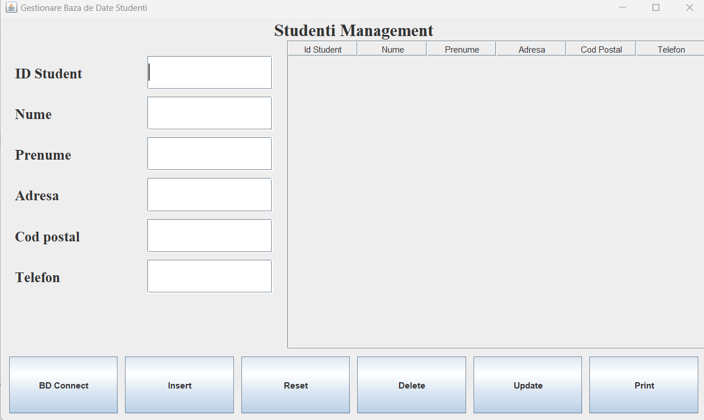

# Student-Management-System-Using-Microsoft-Access-Database


This project is a Java-based that interacts with a Microsoft Access database to manage student data. The system supports CRUD (Create, Read, Update, Delete) operations for student records and includes a feature to print the records in a tabular format.

## Features

- **Database Integration**: Connects to an Access database (`Studenti.accdb`) using JDBC and the UCanAccess driver.
- **CRUD Operations**: 
  - **Create**: Insert new student records.
  - **Read**: Load student records into a JTable from the database.
  - **Update**: Update student information such as name, address, phone number, etc.
  - **Delete**: Delete student records by their ID.
- **ID Management**: Automatically handles student ID assignment, ensuring unique and continuous IDs.
- **Print Table**: Print the student records displayed in a JTable in a formatted table layout.
- **Error Handling**: Informative error messages are shown when operations fail (e.g., database connection errors, invalid ID).

## Technologies Used

- **Java**: Programming language used for the application and GUI (Swing).
- **JDBC**: For database connectivity and operations.
- **Microsoft Access**: Database where student data is stored.
- **UCanAccess**: JDBC driver used to connect to the Access database.

## Installation

To run the project locally, follow these steps:

1. Clone the repository:
    ```bash
    git clone https://github.com/yourusername/student-management-system.git
    ```
2. Make sure you have **Java** installed on your machine (version 8 or higher).
3. Download and include the **UCanAccess JDBC Driver** in your project. You can download it from [UCanAccess website](https://ucanaccess.sourceforge.net/site.html).
4. Open the project in your IDE (e.g., NetBeans, IntelliJ IDEA, Eclipse).
5. Make sure the database file `Studenti.accdb` is located at the correct path (as specified in the code):
    ```
    C:\\Users\\win\\OneDrive\\Documente\\NetBeansProjects\\Practica\\Studenti\\Studenti.accdb
    ```
    You may need to adjust the path based on your setup.
6. Run the `Main` class to start the application.

## Usage

- **Insert Data**: Add new student records using the UI. The system automatically generates unique student IDs.
- **Load Data**: Display all students from the database in a table.
- **Update Data**: Modify existing student records.
- **Delete Data**: Remove student records from the database and automatically reorder IDs.
- **Print**: Print the student records shown in the table to a printer.

## Example

After launching the application, you can perform various actions from the user interface, such as:

- Adding a new student:
    - Fill in the student details and click the "Insert" button.
- Viewing all students:
    - The students will be displayed in a table.
- Updating student details:
    - Select a student, edit the information, and click the "Update" button.
- Deleting a student:
    - Select the student and click the "Delete" button.

## Screenshots

Here are some screenshots of the application:




## License

This project is open-source and available under the [MIT License](LICENSE).
